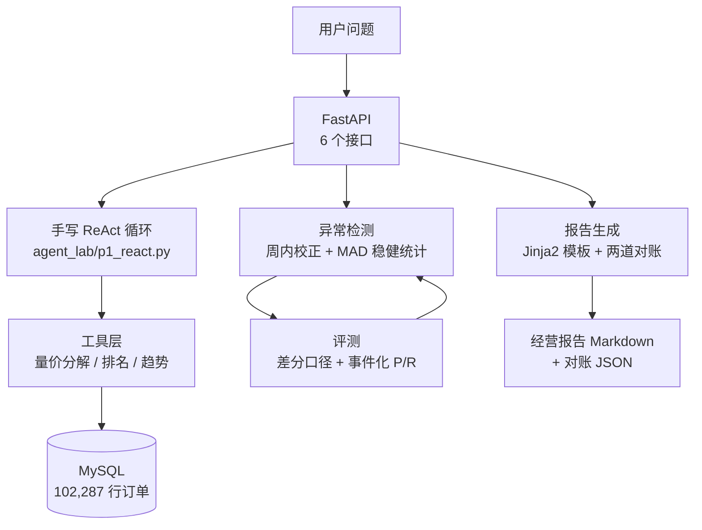
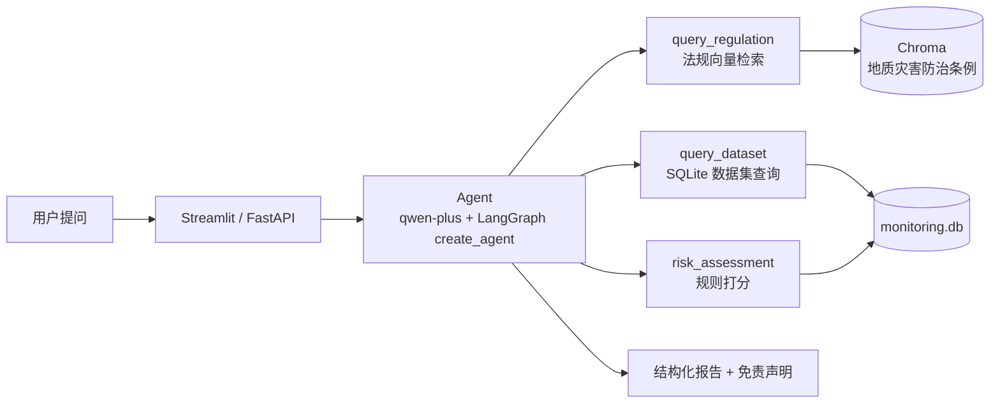

# 钟英浩 · AI 应用开发（Agent / RAG / Python）

> 遥感科班转 Agent 开发 · 2026 届 · 深圳（可随时到岗）
> GitHub：[@Emanonzzh](https://github.com/Emanonzzh) ｜ 联系方式见简历
> 求职意向：**Agent 应用开发 / Python 开发**

这个仓库是两个可独立运行的 AI 应用项目：**全部源码 + 单元测试 + 评测脚本 + 技术文档**。

---

## 📁 仓库结构导览（哪部分是我的作品）

| 位置 | 内容 | 性质 |
|---|---|---|
| **`agent_lab/`** | 销售经营分析 Agent：工具层 / 异常检测 / 评测 / 报告对账 / FastAPI / Streamlit 看板 | ⭐ **项目一（作品）** |
| **`day21.py`** `day22_seed_data.py` `day23_risk.py` `api_rag.py` `Dockerfile` `deploy.sh` | 遥感监测智能助手：三工具 Agent + 一键部署 | ⭐ **项目二（作品）** |
| `rag_eval.py` `rag_eval_questions.py` | 遥感项目的检索评测（12 题 × 4 组参数对比） | ⭐ 评测证据 |
| `agent_lab/tests/` | 233 项 pytest 单测（不连库、不调模型，0.3 秒跑完） | ⭐ 质量证据 |
| `docs/` | 复现指南、项目框架、SQL 入门与进阶 | 📄 技术文档 |
| `AGENTS.md` | 已修过的 5 个真 bug、环境、技术坑、**未验证项清单** | 📄 工程记录 |
| `monitoring.db` `知识库.txt` `地质灾害防治条例.txt` `点位数据.json` `监测报告.txt` | 数据与知识库素材 | 🗂 数据 |

> **想快速看代码** → `agent_lab/代码导读.md`
> **想看踩过哪些坑** → `AGENTS.md`（5 个真 bug 的成因与修法，含端口被静默抢占、并发竞态）
> **想看评测怎么做的** → `agent_lab/eval/anomaly_report.md`

---

# 项目一：销售经营分析 Agent（真实电商数据 · 独立开发）

> 在开源企业级项目（FastAPI + MySQL + Redis + Nginx + LangGraph）基础上做**增量演进**，
> 补齐它缺失的「发现异常 → 逐维下钻 → 量价归因 → 经营报告」分析闭环。
> 数据：仓库自带 **102,287 行真实电商订单**。

## 三个可验证的硬指标（每条都能自己跑出来）

| 指标 | 结果 | 怎么复现 |
|---|---|---|
| **量价三因子分解精确加总** | 三项之和 − 总变化 = **0.0**（断言校验） | `python agent_lab/tools.py` |
| **异常检测** | 查全 **100%**（6/6 注入事件）· **无关误报 0** · F1 70.59% | `python agent_lab/inject_anomalies.py` → `python agent_lab/evaluate_anomaly.py` |
| **报告数字对账** | 文本级 88 个数字 **0 违规** · 数据库级 **11/11 复算一致 Δ=0.0** · 对账器自测通过 | `python agent_lab/report.py` |

## 架构



## 核心设计（面试重点）

- **数字由代码产生，模型不碰数值**：报告模板里只有占位符，所有数值在 Python 里算好后以字符串传入；
  LLM 只写不含数字的自然语言，且其文本仍要过一遍对账。
- **手写 ReAct 循环，不依赖框架**：自己实现多轮循环、步数上限、token 预算、
  **重复动作检测**、observation 截断、**错误回传**、每步轨迹与 token 统计。
- **错误回传**：工具报错不直接抛异常，而是作为 observation 喂回模型 → 让它**读懂错误再修正**
  （压测中模型据此成功从"数据库超时"中恢复）。
- **异常检测的四条原则**：最小支持度门槛 / **周内效应校正**（同星期几基线）/ 日历校正 / MAD 稳健统计。
- **评测方法论**：**差分口径**剔除真实业务事件的噪声地板 + **事件化后处理**
  （持续型异常天然产生「进入+内部+恢复」多个检出点）。

## 没有那份真实数据？三步建一个能跑的样例库

本仓库**不分发**那 102,287 行订单 —— 数据集由上游开源项目 `ai-commerce-intelligence-platform`（README 声明 MIT）提供。
为了让任何人 clone 完就能把整条链路跑起来，这里放了一个**样例数据生成器**：

```bash
# 0) 建表（schema 摘自上游 sql/01_create_table.sql，表名保持 orders，代码一行都不用改）
mysql -u <user> -p <你的库> -e "source sql/01_create_table.sql"

# 1) 生成样例 CSV（同 schema、同分布量级；--seed 固定则输出可复现）
python agent_lab/make_sample_data.py --rows 1000 --out sample_orders.csv

# 2) 灌进 orders 表（纯 INSERT，只需要普通账号就有的权限）
python agent_lab/load_sample_data.py --csv sample_orders.csv --table orders

# 3) 跑起来
python agent_lab/report.py            # 出报告 + 两道数字对账
python agent_lab/api.py               # 起服务，打开 http://127.0.0.1:8010/docs
```

> ⚠️ **样例数据是随机数。** 它能证明"流程跑得通"，**不能**用来复算本仓库任何文档里出现的数字
> （102,287 行、+15.92%、量效应 2,020,698.05、P/R/F1 等）。那些结论只在真实数据集上成立。
>
> 三步已在 2026-09-23 实测跑通（建表 → 生成 → 载入 → KPI 查询，重复载入幂等）。
> 为什么不用 `LOAD DATA INFILE`：它需要**全局 FILE 权限**，缺权限时 MySQL 返回的是 **1045**
> 而不是 1044，很容易被误判成密码错误；`LOAD DATA LOCAL INFILE` 又受服务端 `local_infile` 开关限制。
> 细节见 `sql/02_import_data.sample.sql` 头部与 `agent_lab/load_sample_data.py` 的 docstring。

## 快速开始

```bash
# 前置：MySQL 里要有 orders 表（真实 102,287 行，或按上一节自建样例库）
#       + .env 配好 DB_USER/DB_PASSWORD/DB_NAME/LLM_API_KEY

python agent_lab/tools.py                 # 工具自检（不花钱）
python agent_lab/anomaly.py               # 检测器自检：对比周内校正前后的误报量
python agent_lab/inject_anomalies.py      # 造带 ground truth 的评测集
python agent_lab/evaluate_anomaly.py      # 评测 → eval/anomaly_report.md
python agent_lab/report.py                # 出经营报告 + 两道对账
python agent_lab/api.py                   # 起 FastAPI 服务
python agent_lab/api_smoke_test.py        # 7 项接口冒烟测试
python agent_lab/p1_react.py              # 手写 ReAct 跑 3 个真实问题
python agent_lab/p1_stress.py             # 6 场景故障注入压测
```

启动后打开 **http://127.0.0.1:8010/docs** 可直接点着调接口。
（端口不是默认的 8000：本机 8000 被 C-Lodop 打印控件 `CLodopPrint32.exe` 开机自启占用，
且它绑 `0.0.0.0:8000`，会让我们的 `127.0.0.1:8000` **起了却访问不到** —— 详见 `agent_lab/api.py` 的 `PORT` 注释。）

## 目录

| 文件 | 说明 |
|---|---|
| `agent_lab/tools.py` | 4 个确定性分析工具（内部查 MySQL）+ KPI 口径表 + **量价三因子分解**（含加总断言） |
| `agent_lab/make_sample_data.py` | 样例数据生成器：与真实数据**同 schema、同分布量级**，`--seed` 可复现（不含任何真实订单） |
| `agent_lab/load_sample_data.py` | 把样例 CSV 灌进 `orders`：走 INSERT 而非 `LOAD DATA`，因为后者要全局 FILE 权限 |
| `agent_lab/anomaly.py` | 异常检测：周内效应校正 + 日历校正 + MAD 稳健统计 + 脉冲/漂移两类 |
| `agent_lab/inject_anomalies.py` | 注入 6 个已知异常造评测集（副本表，不动原表） |
| `agent_lab/evaluate_anomaly.py` | 差分口径 + 事件化后处理的 P/R/F1 评测 + 门槛扫描 + 误报归因 |
| `agent_lab/report.py` | 报告生成 + **两道数字对账 + 对账器自测** |
| `agent_lab/api.py` | FastAPI 6 接口（`/health` `/metrics` `/anomalies` `/report` `/reconciliation` `/analyze`） |
| `agent_lab/api_smoke_test.py` | Python 客户端冒烟测试（7 项） |
| `agent_lab/p1_react.py` | **手写 ReAct 循环**（不依赖框架） |
| `agent_lab/p1_stress.py` | 6 场景故障注入压测 |
| `agent_lab/代码导读.md` | 读码顺序 / 关键代码片段 / 面试"讲代码"路线 / 9 个追问 |
| `agent_lab/FastAPI入门.md` | FastAPI 零基础入门（结合本项目代码） |
| `docs/销售经营分析Agent_项目框架.md` | 项目一分层架构、双线设计、**明确列出的缺口** |

---

# 项目二：遥感监测智能助手（RAG + 多工具 Agent）

基于 **RAG + 多工具 Agent** 的遥感地质灾害智能问答系统：支持自然语言查询地面沉降、滑坡预警、形变风险等问题，并给出**带法规依据**的回答与**结构化风险报告**。

> **在线体验**：http://47.76.101.97 （阿里云 ECS / Ubuntu 22.04，Docker 容器 + Nginx 反向代理）
> 注意是 **`http://`** 不是 https，且**没有 TLS**；手机 Chrome 若自动升级到 https 会打不开，需手动输全 `http://`。

## 项目亮点

- **一个 Agent 三把刀**：法规问答（RAG）+ 数据集查询（SQLite 真实元数据）+ **形变风险评估（规则打分）**
- **数据诚实**：知识库为 gov.cn《地质灾害防治条例》（真实法规）；真实数据集注明出处；示例数据明确标注
- **风险评估不交给 LLM 瞎评**：速率/加速/异常三指标 Python 规则打分，LLM 只负责解释
- **检索评测**：自建 12 题测试集，`chunk_size`(100/400) × `k`(2/4) 四组对比，**命中率 83% → 100%**
- **可溯源**：条款检索结果带 `【来源：第X条】` 标签（条款号元数据，切片时注入），用户可核对原文
- **fail-fast 配置管理**：api_key 启动即校验；所有魔法数字收拢 `config.py` 并注明评测依据

## 演示截图

<!-- TODO: 截图三张放到 repo 的 screenshots/ 目录后补进来：
1. 网页首页（三工具 Agent 界面）
2. 风险分析回答（结构化报告 + 免责声明）
3. 法规问答（带【来源：第X条】溯源标签）|
-->

## 检索评测结果（重点证据）

12 道法规问答测试集（问题 + 期望命中条款关键词），四组参数对比实验：

| chunk_size | k | 命中 | 命中率 |
|:---:|:---:|:---:|:---:|
| 100 | 2 | 10/12 | 83% |
| 100 | 4 | 11/12 | 92% |
| 400 | 2 | 10/12 | 83% |
| **400** | **4** | **12/12** | **100%** |

**结论**：小切片造成语义碎片，是主体命中率瓶颈；**适度加大切片 + 提高 k 显著提升命中率**。但 k 越大 token 成本越高、噪音越多——**k 取"最小够用"**，评测的价值是用数据代替拍脑袋定参数。最优参数（400 / k=4）已固化在 `config.py` 并注明评测依据。

## 架构



## 快速开始

```bash
pip install -r requirements.txt
export DASHSCOPE_API_KEY=你的密钥
streamlit run day21.py            # 三工具 Agent 网页版
python api_rag.py                 # FastAPI 接口
bash deploy.sh                    # 服务器一键部署
```

## 技术栈

Python · LangChain · LangGraph · Chroma · MySQL · SQLite · FastAPI · Streamlit · Docker · Nginx · 通义千问 qwen-plus · DeepSeek · text-embedding-v3

---

# 项目文档导航

| 文档 | 用途 |
|---|---|
| `AGENTS.md` | 仓库既有事实与约定：已修过的 5 个真 bug、环境、技术坑、**未验证项清单** |
| `agent_lab/代码导读.md` | 读码顺序 + 关键代码片段 + 9 个"讲代码"追问 |
| `agent_lab/FastAPI入门.md` | FastAPI 零基础入门（结合本项目代码讲） |
| `docs/复现指南_ai-commerce-intelligence-platform.md` | 项目一如何从零复现（数据导入 / 依赖 / 启动 / 验收） |
| `docs/销售经营分析Agent_项目框架.md` | 项目一分层架构、双线设计、明确写出的缺口 |
| `docs/第二个项目选型_销售数据分析Agent.md` | 为什么选这个题目、边界怎么定 |
| `docs/SQL增删改查入门.md` / `docs/SQL练习_销售项目进阶.md` | SQL 入门与进阶练习（绑定项目真实数据） |

> **为什么这里没有学习笔记和求职材料**：本仓库是**作品库**——只放代码、测试、评测和技术文档。
> 学习过程、刷题记录、面试准备不在这个仓库里，也不该在：一个面向 HR 的仓库应该回答"你能做什么"，
> 而不是"你还在学什么"。项目里真实的坑和修坑过程**保留在 `AGENTS.md`**，那部分属于工程记录。

# 作者

遥感科学与技术背景（毕设：云贵高原湖泊 2013–2022 动态变化分析，含 6 种水体指数精度对比 + K-Means + 回归归因），
2026 届毕业生。先在遥感项目打通「RAG + Agent + Docker 上线」完整链路，再在真实电商数据上做量价归因与 Agent 机制的手写实现，
两条线都保持**"结论可验证、数据边界讲清楚"**的习惯。

目标岗位：**Agent 应用开发 / Python 开发**（深圳）。
